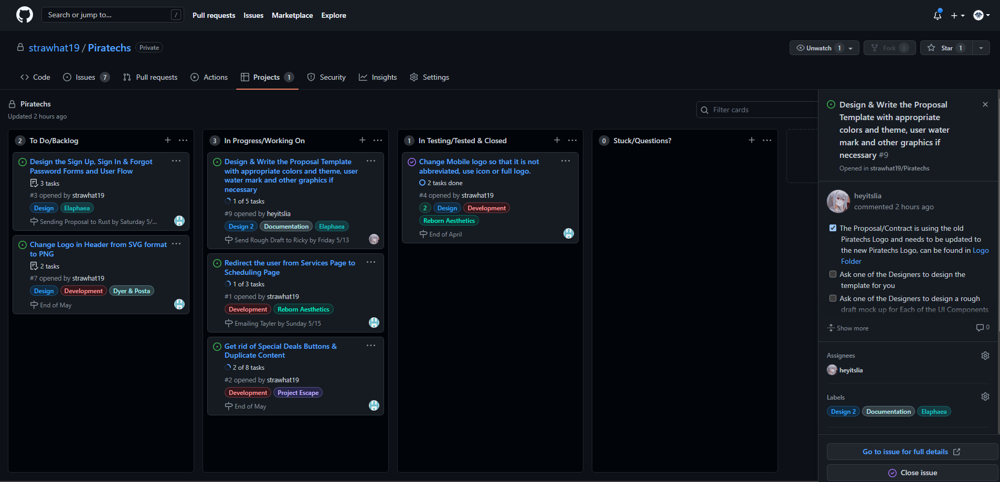

# Piratechs

    

[](https://travis-ci.org/mattlewis92/angular-calendar) [](https://opensource.org/licenses/MIT) [](https://twitter.com/Strawhat_19)

#### This is a Folder // Directory // Repository to store all interal Piratechs Team Documents.




## Table of Contents

- [Usage](#usage)
- [Installation](#installation)
- [Licensing](#licensing)
- [Questions](#questions)

## Usage

You can view files at the root directory

## Installation

```bash
download folder
then
npm install
```

## Licensing

####

      MIT License

      Copyright (C) 2012-2020 by various contributors (see AUTHORS)

      Permission is hereby granted, free of charge, to any person obtaining a copy
      of this software and associated documentation files (the "Software"), to deal
      in the Software without restriction, including without limitation the rights
      to use, copy, modify, merge, publish, distribute, sublicense, and/or sell
      copies of the Software, and to permit persons to whom the Software is
      furnished to do so, subject to the following conditions:

      The above copyright notice and this permission notice shall be included in
      all copies or substantial portions of the Software.

      THE SOFTWARE IS PROVIDED "AS IS", WITHOUT WARRANTY OF ANY KIND, EXPRESS OR
      IMPLIED, INCLUDING BUT NOT LIMITED TO THE WARRANTIES OF MERCHANTABILITY,
      FITNESS FOR A PARTICULAR PURPOSE AND NONINFRINGEMENT. IN NO EVENT SHALL THE
      AUTHORS OR COPYRIGHT HOLDERS BE LIABLE FOR ANY CLAIM, DAMAGES OR OTHER
      LIABILITY, WHETHER IN AN ACTION OF CONTRACT, TORT OR OTHERWISE, ARISING FROM,
      OUT OF OR IN CONNECTION WITH THE SOFTWARE OR THE USE OR OTHER DEALINGS IN
      THE SOFTWARE.

      Copyright 1998 by the Massachusetts Institute of Technology.

      Permission to use, copy, modify, and distribute this software and its
      documentation for any purpose and without fee is hereby granted, provided that
      the above copyright notice appear in all copies and that both that copyright
      notice and this permission notice appear in supporting documentation, and that
      the name of M.I.T. not be used in advertising or publicity pertaining to
      distribution of the software without specific, written prior permission.
      M.I.T. makes no representations about the suitability of this software for any
      purpose.  It is provided "as is" without express or implied warranty.

#### https://opensource.org/licenses/MIT

## Questions

#### Official Website: [Piratechs](https://piratechs.com/)

#### GitHub Profile: [_strawhat19_](https://github.com/strawhat19)

#### GitHub Organization: [_Piratechs-LLC_](https://github.com/Piratechs-LLC/)

#### Contact me or ask me questions at [rahmed@piratechs.com](mailto:rahmed@piratechs.com)
